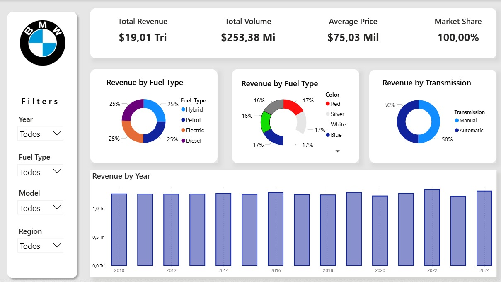

# 📊 BMW Sales Dashboard

## 🧩 Business Task

Analyze BMW sales performance using Power BI and Excel as the data source.

The goal is to provide insights into sales distribution across multiple parameters such as car model, year, color, fuel type, transmission, and region.

## 📁 Data Sources

Sales data from BMW dataset `BMW Sales data (2010-2024).csv`

Processed and visualized in Power BI `BMW Sales Dashboard.pbix`

## 🛠 Tools Used

Microsoft Power BI for data transformation and visualization

## 📌 Key Insights

Total revenue, total volume, average price, and market share

Revenue by car model, year, and region

Sales by fuel type (Hybrid, Petrol, Electric, Diesel)

Revenue by transmission type (Manual vs Automatic)

Revenue distribution by car color

## 📄 Dashboard Preview

## 📈 Conclusions

The analysis of BMW sales reveals several key patterns:

Balanced fuel distribution: Sales are evenly spread across Hybrid, Petrol, Electric, and Diesel, indicating a diversified portfolio and strong positioning in both traditional and emerging energy markets.

Stable growth trend: Revenue has shown consistent performance year over year, with peaks in recent years reflecting market expansion and higher vehicle demand.

Transmission preferences: Sales are equally divided between Manual and Automatic, highlighting different consumer profiles and regional preferences.

Color impact on sales: Revenue is evenly distributed across popular car colors such as Red, Silver, White, and Blue, suggesting that color choice is not a decisive factor in sales dominance.

Regional performance: Variations in revenue by region suggest opportunities for strategic marketing and dealership optimization in specific markets.

Overall, the dashboard provides a clear and comprehensive view of BMW’s sales performance, helping identify trends and guiding data-driven decision-making for future strategies.
## 👨‍💻 Developed by
Khaled Tarek Ghattas
Electrical Engineering Student – Unioeste
[LinkedIn Profile](https://www.linkedin.com/in/khaledtarekg)
